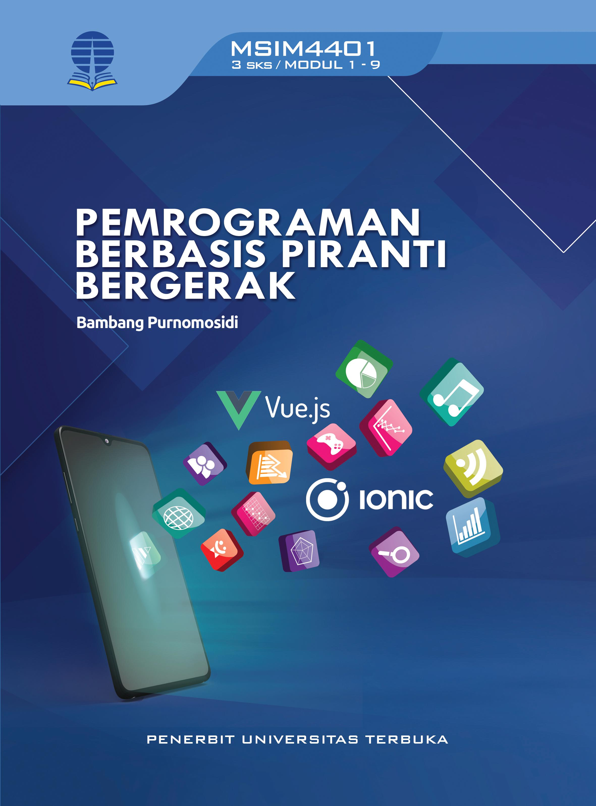

# Books

## Free / Open Books

Some books live in this repo. They are all in Bahasa Indonesia. In the meantime, all are work-in-progress:

1.  [Pemrograman Rust](pemrograman-rust/)
2.  [Pemrograman Go](pemrograman-go/)

Jika ingin berkontribusi, silahkan mempelajari [cara berkontribusi](kontribusi.md).

## Non-free / Proprietary Books

| No | Title | ISBN Search | Book Website | Cover |
|----|-------|-------------|--------------|-------|
| 1. | Pemrograman Berbasis Piranti Bergerak | https://isbn.perpusnas.go.id/Account/SearchBuku?searchTxt=978-623-312-884-1&searchCat=ISBN | http://bahanajar.ut.ac.id/books/bookdetail/1378/MSIM4401---Pemrograman-Berbasis-Piranti-Bergerak |  |

